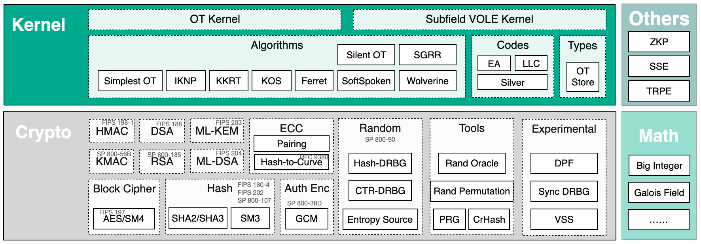

YACL Documentation
===============================

YACL (Yet Another Common Cryptography Library) is a sub-project of `SecretFlow <https://github.com/secretflow/>`_, it is a C++ library that provides cryptography, network and io modules for other SecretFlow repositories. Yacl is designed to be a **low-level** library that could be either integrated into a big **secure system**, or used in a standalone way for a **quick POC** (see: `Develop <src/develop/index>`_), or even help with your **security/cryptography research** (see: `Research <src/research/index>`_).

- **About Cryptography Modules:** The crypto modules in Yacl implement many state-of-art secure computation protocols, including primitives like OT, VOLE, TPRE, and tools like PRG, RO. Check the full list of Yacl's `supported algorithms list <src/algorithms>`_.
- **About Network ("link") Modules:** The network ("link") module in Yacl uses `BRPC <https://brpc.apache.org/>`_ to handle network. And we also provide a "mocked" in-memory link.
- **About IO Modules:** Yacl also provides many io modules for kv storage, file io, `bristol circuits <https://nigelsmart.github.io/MPC-Circuits/>`_, and so on.

The following parts describes the top-level folders of Yacl repository.

- `yacl/base/ <https://github.com/secretflow/yacl/tree/main/yacl/base>`_: some basic types and utils in yacl.
- `yacl/crypto/ <https://github.com/secretflow/yacl/tree/main/yacl/crypto>`_: crypto algorithm without link.
- `yacl/kernel/ <https://github.com/secretflow/yacl/tree/main/yacl/kernel>`_: crypto kernel that includes link with (WIP) multi-thread support, i.e. OT, DPF.
- `yacl/io/ <https://github.com/secretflow/yacl/tree/main/yacl/io>`_: a simple streaming-based io library.
- `yacl/link/ <https://github.com/secretflow/yacl/tree/main/yacl/link>`_: a simple rpc-based MPI framework, providing the `SPMD <https://en.wikipedia.org/wiki/SPMD>`_ parallel programming capability.

.. toctree::
   :maxdepth: 2
   :caption: Contents
   :numbered: 1
   :titlesonly:

   src/getting_started
   src/develop/index
   src/research/index
   src/security
   src/algorithms
   src/changelog
