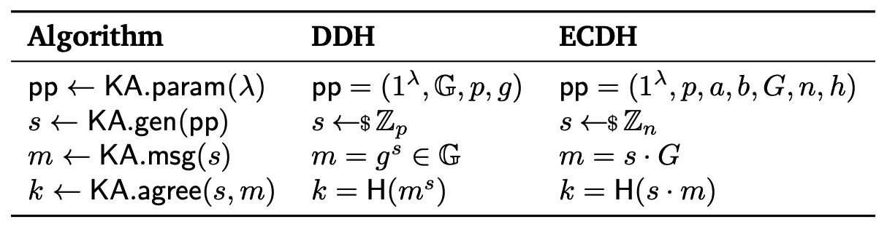
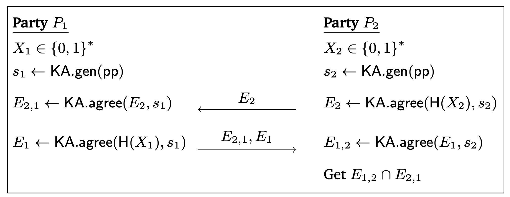

Example: Build a PSI Protocol
=============================

This is an example of how to use Yacl's ECC api and link to build up a `PSI (Private Set Intersection) <https://en.wikipedia.org/wiki/Private_set_intersection>`_ protocol. The code of this example is available at `link <https://github.com/secretflow/yacl/tree/main/examples/psi/cpp>`_.

.. warning::
   This example is merely designed for demonstration only, please do not use this example in production.

Step 1: Understand ECDH-PSI
^^^^^^^^^^^^^^^^^^^^^^^^^^^

Before we start, the ECDH-PSI protocols are formally designed as the following, where lambda indicates the computational security parameter, and H() indicates a cryptographically secure (collision-free) hash function.

Step 2: Implement Protocol
^^^^^^^^^^^^^^^^^^^^^^^^^^

We provide the implementation in the following codes. Note that it's almost always a good idea to separate the definitions and implementations into ``*.h`` and ``*.cc`` files.

.. literalinclude:: ../../../examples/psi/cpp/ecdh_psi.h
  :language: cpp

.. literalinclude:: ../../../examples/psi/cpp/ecdh_psi.cc
  :language: cpp

Besides the two files, you also need to write a `BUILD.bazel` file to tell `bazel` how to compile your files together.

.. code::

   load("//bazel:yacl.bzl", "yacl_cc_binary", "yacl_cc_library", "yacl_cc_test")

    package(default_visibility = ["//visibility:public"])

    yacl_cc_library(
        name = "ecdh_psi",
        srcs = [
            "ecdh_psi.cc",
        ],
        hdrs = [
            "ecdh_psi.h",
        ],
        deps = [
            "//yacl/crypto/ecc",
            "//yacl/link",
        ],
    )

    yacl_cc_test(
        name = "ecdh_psi_test",
        srcs = ["ecdh_psi_test.cc"],
        deps = [":ecdh_psi"],
    )

Step 3: Write and Run Tests
^^^^^^^^^^^^^^^^^^^^^^^^^^^

Also, we recommend all users to write unit tests for implementations. In order to run the following tests, you can ``cd examples && bazel test //psi/cpp:ecdh_psi_test``.

.. literalinclude:: ../../../examples/psi/cpp/ecdh_psi_test.cc
  :language: cpp

Step 4: Generate Executables and Run with CSV files
^^^^^^^^^^^^^^^^^^^^^^^^^^^^^^^^^^^^^^^^^^^^^^^^^^^

Also, alternatively you can build an executable for two users to actually run the PSI protocols with their private data. We show an example ``main.cc`` file in the below.

.. literalinclude:: ../../../examples/psi/cpp/ecdh_psi_main.cc
  :language: cpp

In order to compile, run ``bazel build //psi/cpp:ecdh_psi_main -c opt``. The ``-c opt`` flag tells the bazel build system to build a release (or, optimized) version of the executable.

To run the exeutable, open two terminals in the same machine.

.. note::

   Please make sure your machine's 10086 and 10087 ports are available.

In the first terminal, at yacl's project root, run

.. code:: bash

    ./bazel-bin/psi/cpp/ecdh_psi_main --rank=0

Then in the second terminal, at yacl's project root, run

.. code:: bash

    ./bazel-bin/psi/cpp/ecdh_psi_main --rank=1
